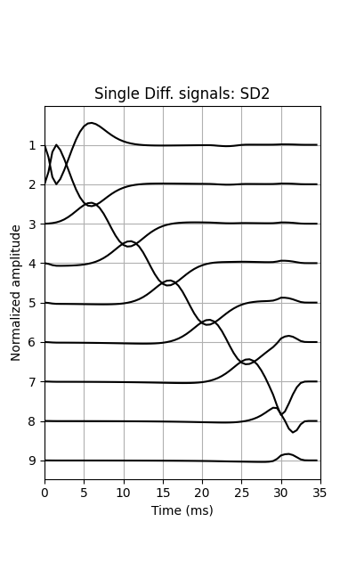

# semg-sim
Surface electromyography (sEMG) simulation model

# Description

Implementation of the sEMG simulation model described in [Merletti et al. (1999)](https://doi.org/10.1109/10.771190).

# How to use

Run `pip install -r requirements.txt` to install the dependencies.

See the `main.py` script for an example of use of the modules. This script simulates the example described in the original paper. The obtained signals are shown below.

  
   
   

